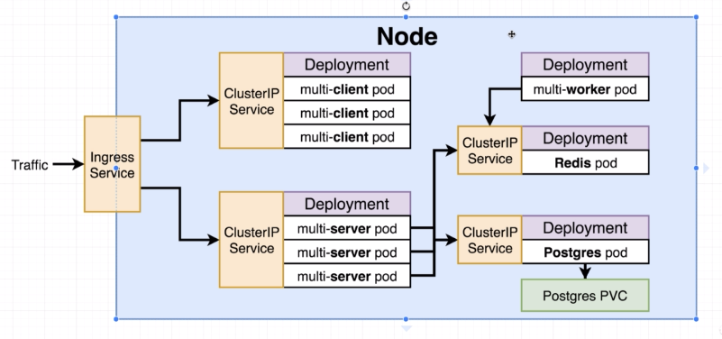

# full-stack-k8s

[](https://travis-ci.com/miloofcroton/full-stack-k8s)

## architecture




## installation reqs

- brew (duh)
- docker
- kubectl
- virtualbox
- minikube
- google cloud sdk cli

## service reqs

- travis
- github
- google cloud

## tech choices

- `kubernetes` and `docker` (obv)
- `google cloud`
- `google domains`
- `travis`
- `helm`
- `tiller`
- `ingress-nginx` by `kubernetes` (github.com/kubernetes/ingress-nginx), not `kubernetes-ingress` by `nginx`
- `cert-manager` by `jetstack`

## work flow

### local

- this will get minikube up and running, which lets you create nodes on your local machine.

    ```shell
    minikube up
    minikube addons enable ingress
    kubectl create secret generic pgpassword --from-literal PGPASSWORD=<password>
    ```

    to use the existing actual codebase, you annoyingly have to do one of two things:

    1. change the rewrite rules to not have regex, and remove the '$1' from the rewrite target
    2. make minikube work with RBAC. in order to do this, you have to make minikube use the latest version of ingress-nginx via helm. I am still working on a solution for this, but see the script below for a start.

    ```shell
    minikube addons disable ingress

    curl -LO https://git.io/get_helm.sh
    chmod 700 get_helm.sh
    ./get_helm.sh

    kubectl create clusterrolebinding add-on-cluster-admin --clusterrole=cluster-admin --serviceaccount=kube-system:default
    ```

    thought to self: I'm on 0.26.1 for minikube, and 1.0.1 is available. upgrade when you get a chance, and this might help with the RBAC issues.

### google cloud

#### creating setup

- had to make travis use the new api. First, fix ~/.travis/config.yml as follows (note the last line, it was `.org`):
    ```yaml
    repos:
    miloofcroton/full-stack-k8s:
        endpoint: https://api.travis-ci.com/
    ```
  then, I had to re-login using `travis login --pro` instead of just `travis login`

- create service account in gcloud. via cloud console:
  - any service account id
  - kubernetes engine admin
  - key type: json
  - download the json

- ran this to encrypt gcloud secret:
    ```shell
    travis encrypt-file service-account.json -r miloofcroton/full-stack-k8s
    ```

- ran this in the gcloud shell to set context and then create the secret
    ```shell
    gcloud config set project full-stack-k8s
    gcloud config set compute/zone us-west1-a
    gcloud container clusters get-credentials k8s-cluster
    kubectl create secret generic pgpassword --from-literal PGPASSWORD=<password>
    ```
- installed helm and tiller via https://helm.sh/docs/using_helm/#installing-helm, then created service account and cluster role binding, then assigned cluster role binding to service account. This is all in the glcoud console.

    ```shell
    curl -LO https://git.io/get_helm.sh
    chmod 700 get_helm.sh
    ./get_helm.sh
    kubectl create serviceaccount --namespace kube-system tiller
    kubectl create clusterrolebinding tiller-cluster-role --clusterrole=cluster-admin --serviceaccount=kube-system:tiller
    helm init --service-account tiller --upgrade
    helm install stable/nginx-ingress --name my-nginx --set rbac.create=true
    ```
- save helm to your google cloud console path (insert the following in ~/.bashrc), if you intend to access it this way, with an automatically scoped kubectl. I think it's fine for a couple commands, but it's way too slow if you need to do much work on it.

    ```shell
    export PATH="$(echo ~)/helm-v2.6.0/linux-amd64:$PATH"
    ```
- DNS setup

    Name | Type | TTL | Data
    ---|---|---|---
    @ | A | 1h | 34.83.23.38
    www | CNAME | 1h | miloofcroton.io.


- install `cert-manager` (via kubectl for now because the helm chart is buggy)

    ```shell
    # Create the namespace for cert-manager
    kubectl create namespace cert-manager

    # Label the cert-manager namespace to disable resource validation
    kubectl label namespace cert-manager certmanager.k8s.io/disable-validation=true

    # Resolve nuances with GKE permissions
    kubectl create clusterrolebinding cluster-admin-binding \
    --clusterrole=cluster-admin \
    --user=$(gcloud config get-value core/account)

    # Install the CustomResourceDefinitions and cert-manager itself

    kubectl apply -f https://raw.githubusercontent.com/jetstack/cert-manager/release-0.7/deploy/manifests/cert-manager.yaml --validate=false
    ```

- deploy once, get info on the certificate, then add that info to the ingress-service file


#### after setup

- push to master (or merge PR)
- travis automatically deploys to gcloud


## clean up

## google cloud

- go to project selector/list
- select project and click delete
- enter project id and click 'shut down'

### local

run the following:
```shell
minikube stop
```

run `docker ps` to get any existing containers, then run the following:
```shell
docker stop container_id
```


## notes


